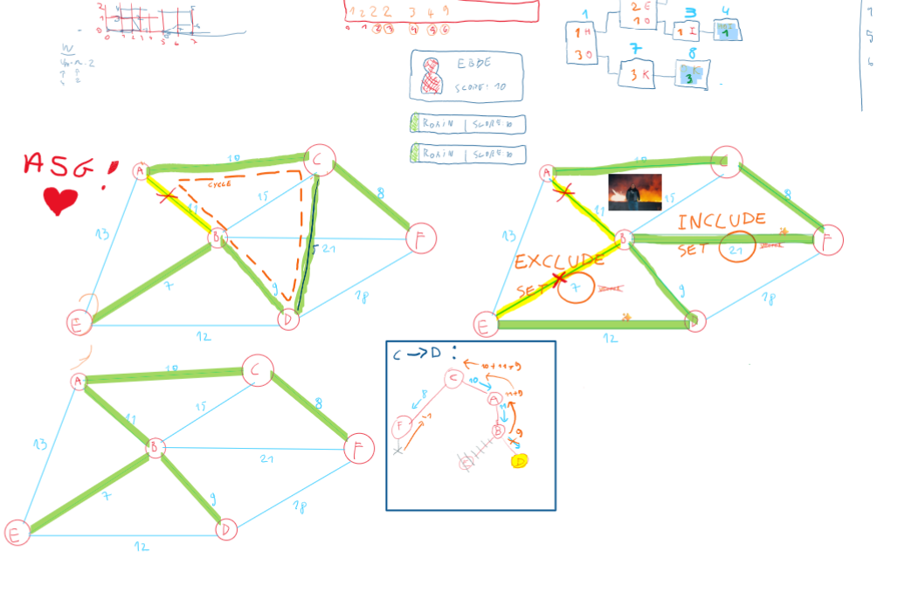

# MijlPunt 1 #

-> MST minum spanning tree
* Kruskal's Algorithm
* Prim's Algorithm
* Borůvka’s Algorithm

| **Aspect**               | **Kruskal's Algorithm**                          | **Prim's Algorithm**                           | **Borůvka’s Algorithm**                         |
|--------------------------|------------------------------------------------|-----------------------------------------------|------------------------------------------------|
| **Purpose**              | Finds a Minimum Spanning Tree (MST).            | Finds an MST.                                  | Finds an MST.                                   |
| **Approach**             | Greedy.                                         | Greedy.                                        | Greedy and iterative.                           |
| **Process**              | Sorts edges by weight and adds the smallest edge that doesn’t form a cycle. | Starts from a vertex and grows the MST by adding the smallest edge connecting to an unvisited vertex. | Adds the cheapest edge for each component in parallel; merges components iteratively. |
| **Data Structure Used**  | Union-Find (Disjoint Set).                      | Priority Queue (Heap).                        | Union-Find for component merging.              |
| **Edge Handling**        | Processes edges globally.                       | Processes edges locally (around the current tree). | Processes edges in parallel for all components.|
| **Time Complexity**      | \(O(E \log E + E \alpha(V))\) (sorting edges + Union-Find). | \(O(E + V \log V)\) (with Fibonacci Heap).     | \(O(E \log V)\) (depends on edge contraction). |
| **Space Complexity**     | \(O(E + V)\).                                   | \(O(E + V)\).                                  | \(O(E + V)\).                                   |
| **Graph Representation** | Works well with edge lists.                     | Works best with adjacency lists/matrices.     | Works with edge lists or adjacency structures. |
| **Parallelization**      | Difficult to parallelize.                       | Less suited for parallelization.              | Highly parallelizable due to independent component processing. |
| **Best Use Case**        | Sparse graphs or when edges are already sorted. | Dense graphs or adjacency list available.     | Highly distributed systems or very large graphs. |
| **Drawbacks**            | Sorting can be costly for large edge lists.     | Requires a good data structure for efficiency.| Requires more iterations and is less intuitive. |

## edge cases ##
1. Eilanden
2. meerder gelijke gewichten

# Channels toevoegen
* Graph coloring

# Nieuwe connecties introduceren
1: Voeg nieuwe connectie toe
2: vind de lus
3: verwijder connectie van gevonden lus met grootste weight

# Ebbe's OneNote notities: 
